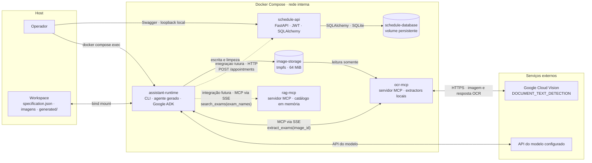

# System Design

## Objetivo e escopo

Este documento apresenta a arquitetura atual em alto nível: containers, integrações, armazenamento compartilhado e fronteiras de confiança. O diagrama representa componentes e suas conexões; não descreve a sequência de execução dos comandos.

Os contratos e passos detalhados ficam nas especificações da [Fase 1](phase1-spec.md), da [Fase 2](phase2-spec.md) e no [plano da Fase 2](phase2-plan.md). O RAG e a API de agendamento estão implementados como serviços independentes; a integração deles ao agente ainda é uma etapa futura.

## Requisitos

### Funcionais

- Validar `specification.json` e gerar deterministicamente a factory Python do agente.
- Receber uma imagem pelo comando `process`, acionar a extração OCR e apresentar exames ou uma resposta explícita que solicite revisão manual.
- Reconhecer os dois layouts de referência usando Cloud Vision e classificação local, sem depender de um LLM para selecionar exames.
- Resolver nomes de exames no catálogo versionado e retornar código somente em correspondências exatas e únicas; expor a busca por MCP SSE.
- Receber códigos de exames autenticados por JWT, preservar reservas já existentes e alocar exames novos em slots globais exclusivos; retornar o diff da reconciliação.

### Não funcionais

- Reduzir a exposição de dados pessoais: imagem e texto OCR integral não entram no contexto do modelo; uma barreira local analisa os valores de saída do OCR e suprime todo o resultado quando identifica PII configurada; logs não expõem conteúdo clínico ou identificadores.
- Isolar responsabilidades em containers independentes, conectados pela rede interna do Compose; montar o armazenamento temporário com escrita no runtime e somente leitura no OCR.
- Remover a cópia temporária ao fim do processamento, permitir um processamento por vez e injetar credenciais somente em runtime.
- Manter a interface do CLI previsível: resultado funcional em JSON no `stdout` e logs/falhas sanitizadas no `stderr`.
- Persistir reservas em SQLite e serializar a alocação em transações; fornecer uma sessão SQLAlchemy curta por request e fechar o engine no shutdown.
- Manter a API de agendamento independente e acessível localmente para Swagger; a integração com o agente permanece separada até validação.

Os critérios detalhados de validação, erros, formatos e respostas estão nas especificações das fases correspondentes.

## Containers e integrações

## Responsabilidades

| Elemento | Responsabilidade e interface |
|---|---|
| `assistant-runtime` | Executar `validate`, `generate` e `process`; carregar a factory gerada, orquestrar o agente ADK e produzir o resultado JSON no CLI. |
| `ocr-mcp` | Expor `extract_exams(image_id)` por SSE, ler a imagem temporária, chamar o Cloud Vision, classificar localmente os dois layouts de referência e aplicar a barreira local de PII antes de responder. |
| `rag-mcp` | Carregar e validar o catálogo versionado, construir um índice em memória e expor `search_exams(exam_names)` por SSE; correspondências aproximadas exigem revisão e não retornam códigos. |
| `schedule-api` | Autenticar o usuário por JWT, reconciliar reservas pelo `sub` e alocar slots globais exclusivos por `POST /appointments`; expor Swagger apenas em loopback no Compose local. |
| `schedule-database` | Volume nomeado persistente para o SQLite; contém tabelas de agendamento e os exames relacionados por chave estrangeira. |
| `image-storage` | Volume `tmpfs` temporário compartilhado; o runtime grava e remove arquivos, enquanto o OCR tem acesso somente de leitura. |
| API do modelo | Apoiar o agente na execução da tool aprovada; recebe o identificador interno e os metadados necessários ao agente, nunca a imagem ou o texto OCR integral. |
| Google Cloud Vision | Reconhecer texto e posições na imagem enviada pelo OCR por `DOCUMENT_TEXT_DETECTION`. |
| Docker Compose | Construir os apps separadamente, conectá-los pela rede interna e montar o volume temporário com permissões distintas. |

## Fronteiras de confiança e operação

- `process` aceita somente um nome de arquivo no diretório de entrada permitido. O agente envia um UUID canônico à tool; não escolhe caminhos, URLs, credenciais ou endpoints.
- A cópia temporária fica em `tmpfs`; o runtime tem escrita e o OCR, somente leitura. O runtime permite um processamento ativo por vez e remove a cópia ao terminar.
- A imagem é enviada ao Google Cloud Vision para OCR. O uso de `tmpfs` reduz a retenção local, mas não significa que a imagem permaneça apenas nos containers; a decisão e as garantias do fornecedor estão registradas no [plano da Fase 2](phase2-plan.md).
- A API do modelo e o Cloud Vision são serviços externos separados. As credenciais são injetadas em execução apenas no container que as utiliza e não são copiadas para as imagens Docker nem versionadas.
- O OCR analisa localmente os valores de `exams` e `ambiguous_exams` com Presidio, spaCy em português e recognizers brasileiros configurados. Ao sinalizar PII, devolve somente um status genérico de revisão; se a análise falhar, não libera o resultado. O detector reduz risco e não garante identificar toda PII.
- Logs operacionais não incluem imagem, nome ou caminho do arquivo, UUID, dados pessoais, nomes de exames, texto OCR, prompts ou credenciais.
- O servidor OCR não publica uma porta no host; o runtime o acessa pela rede do Compose. A saída funcional do CLI é JSON em `stdout`; logs e falhas sanitizadas usam `stderr`.
- O servidor RAG também fica restrito à rede do Compose e não publica porta no host. A tool está disponível para clientes MCP; o runtime ainda não a integra ao agente.
- A API de agendamento publica somente em `127.0.0.1:8001` no Compose local para permitir a validação pelo Swagger. O serviço e o banco não estão integrados ao runtime nesta etapa.
- O emissor local de JWT é uma ferramenta de demonstração, desabilitada por padrão e pelo overlay runtime; não substitui um provedor de identidade. O segredo é configuração de runtime e não deve ser versionado.
- Cada request obtém sua própria `Session`; o `Engine` e a fábrica de sessões vivem no lifespan da API. `BEGIN IMMEDIATE` e a restrição única do slot protegem a alocação concorrente.

## Limites atuais

A extração cobre os dois layouts de referência validados: lista numerada sem caixas e formulário com marcações X. Isso não representa suporte geral a documentos médicos ou manuscritos. Novos componentes e fluxos serão incluídos quando suas subfases forem especificadas.
