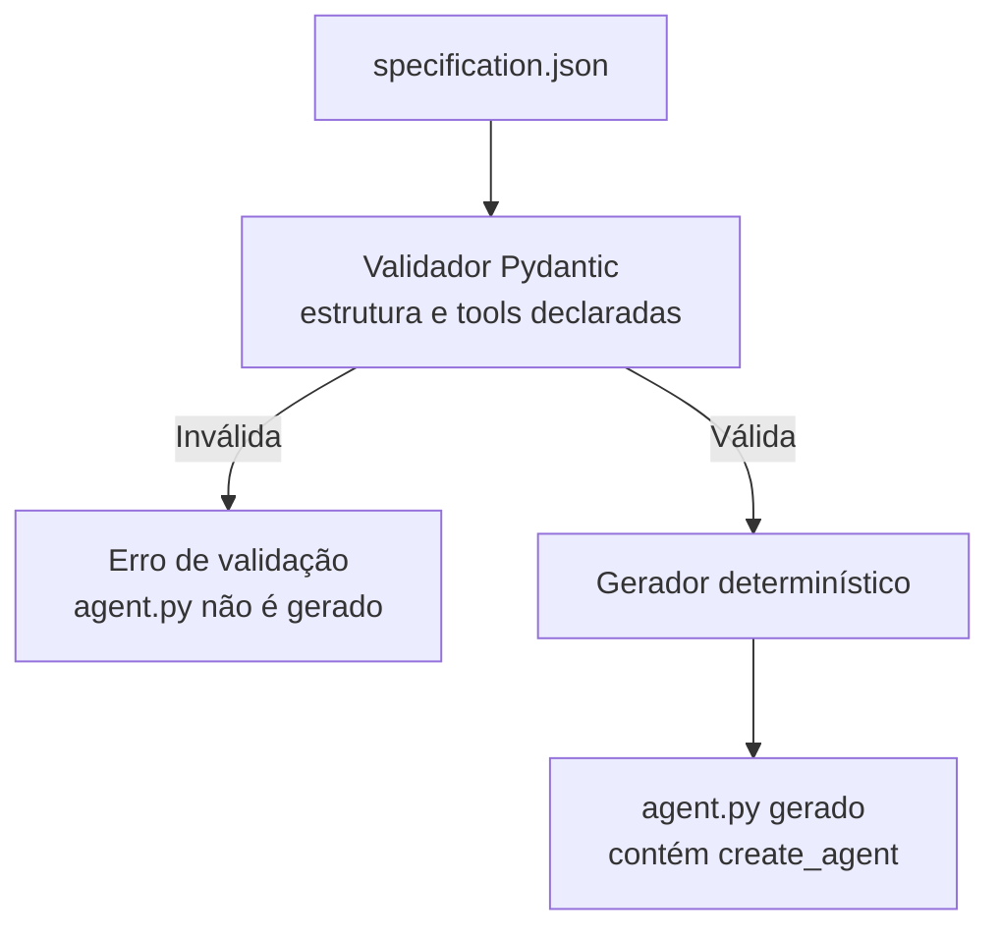

# System design — fase 1

## Objetivo e limite

A fase 1 converte uma especificação JSON validada em uma factory Python determinística. A factory aceita as implementações de tools fornecidas pela aplicação que a chama e instancia um agente Google ADK. A aplicação que compõe essas implementações e executa o agente em produção será detalhada em uma etapa posterior.

Este documento mostra somente o caminho de produção definido para a fase 1. O teste com `InMemoryRunner` e modelo simulado não faz parte do desenho de produção.

## Requisitos

### Funcionais

- Ler e validar a especificação do agente pelo CLI antes da geração.
- Rejeitar campos desconhecidos, valores não permitidos, IDs de tool inválidos, duplicados ou ausentes.
- Gerar Python determinístico que exponha `create_agent(registered_tools)`.
- Exigir que o consumidor forneça exatamente as implementações aprovadas declaradas na especificação antes de instanciar o agente ADK.

### Não funcionais

- Não aceitar código, instruções livres, credenciais ou endereços de MCP no JSON.
- Reproduzir os mesmos bytes de Python para a mesma especificação válida, independentemente da ordem das chaves e das tools na entrada.
- Ser compatível com Python 3.11 ou superior e Google ADK.
- Falhar com caminho do campo e mensagem acionável para especificações inválidas.

O contrato detalhado dos campos, allowlists e tools fica em [phase1-spec.md](phase1-spec.md).

## Componentes e responsabilidades

| Componente | Responsabilidade |
|---|---|
| `specification.json` | Declarar nome, tipo, modelo e IDs de tools, sem código ou endpoints. |
| CLI | Ler o arquivo e expor os fluxos `validate` e `generate`. |
| Validador Pydantic | Aplicar tipos estritos, campos permitidos e regras do agente. |
| Gerador determinístico | Converter a configuração validada em uma factory Python. |
| Factory gerada | Conferir a correspondência exata dos IDs recebidos e criar o objeto `Agent`. |
| Aplicação consumidora | Fornecer o mapa de IDs para funções/adaptadores aprovados; sua implementação está fora desta fase. |
| Google ADK | Construir o agente configurado pela factory. |

## Fluxo de geração

O diagrama mostra a geração: o validador confere a estrutura e as tools declaradas no JSON antes de permitir que o gerador escreva `agent.py`. O arquivo gerado define `create_agent`; o comando `generate` não chama essa função nem instancia um Agent.

## Fronteiras de confiança e falhas

- A especificação controla somente campos enumerados e IDs de tools registrados; não pode introduzir código executável, instruções livres, segredos ou endpoints.
- O mapa de implementações é fornecido pelo consumidor confiável, não pelo JSON.
- Erros de leitura, JSON inválido ou falha de validação interrompem o CLI sem gravar saída gerada.
- Uma divergência entre IDs declarados e registrados interrompe a factory antes de criar o agente.

## Fora do escopo desta versão

A aplicação de produção, chamadas a um modelo real, implementações MCP, API de agendamento, tratamento da imagem e anonimização de PII serão desenhados quando suas fases forem planejadas.
